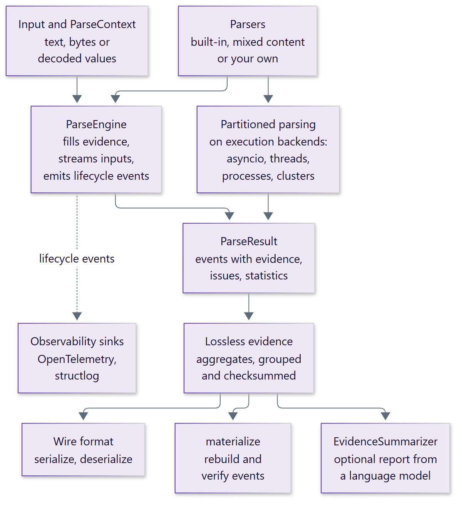

# ParseFabric

**Composable parsers that turn logs, JSON, command output and mixed text into
structured events, with evidence for every event and lossless aggregation.**

ParseFabric is an asynchronous Python library for extracting structured events
from operational text. Every event records exactly where it came from: the
source, line number, byte span, matching pattern and parser version. Events
can be stored as compact, checksummed aggregates that rebuild the exact
original events on demand.

<div class="grid cards" markdown>

-   :material-file-search-outline:{ .lg .middle } **Evidence on every event**

    ---

    Each event carries its source, line, UTF-8 byte span, pattern and parser
    version, so every finding traces back to the input that produced it.

-   :material-puzzle-outline:{ .lg .middle } **Built-in and composable parsers**

    ---

    Parse application and timestamped logs, JSON, Python tracebacks and
    command output, or build your own parser from regex, exact-value and
    predicate patterns.

-   :material-file-document-multiple-outline:{ .lg .middle } **Mixed documents**

    ---

    Route each line of a mixed document to the right parser, parse fenced
    blocks by language and detect unfenced code with tree-sitter. No line is
    lost.

-   :material-archive-check-outline:{ .lg .middle } **Lossless aggregation**

    ---

    Group repeated events into compact, checksummed aggregates in a strict
    wire format, then rebuild and verify every original event.

-   :material-lightning-bolt-outline:{ .lg .middle } **Streaming and parallel**

    ---

    Stream inputs with bounded concurrency, run work in threads, processes or
    your own cluster, and split large documents into independent partitions.

-   :material-chart-timeline-variant:{ .lg .middle } **Observable and checkable**

    ---

    Send lifecycle events to OpenTelemetry or structlog, and summarize
    evidence with a language model whose every claim is checked.

</div>

## A first look

Parse one log line and print each event with its evidence:

```python
--8<--
examples/quickstart.py
--8<--
```

Output:

```text
--8<-- "examples/expected/quickstart.txt"
```

One line produced two events, `timeout` and `error`, because the application
log parser checks every line against every pattern. Both point at the same
line and byte span, and each names the pattern that matched.

## How it fits together

<figure class="diagram" markdown="span">
  { width="600" }
  <figcaption>Parsers run through the engine, or partition by partition on
  execution backends. Both produce the same events, which aggregate into
  lossless evidence.</figcaption>
</figure>

## Next steps

<div class="grid cards" markdown>

-   :material-download-outline: **[Installation](getting-started/installation.md)**

    Install the package and learn what each dependency is for.

-   :material-rocket-launch-outline: **[Quickstart](getting-started/quickstart.md)**

    Parse, stream, aggregate and restore events in a few minutes.

-   :material-book-open-variant: **[User guide](guide/parsing.md)**

    Learn how parsing, evidence, aggregation and execution work.

-   :material-code-braces: **[API reference](reference/index.md)**

    Every public class and function, generated from the source.

</div>
